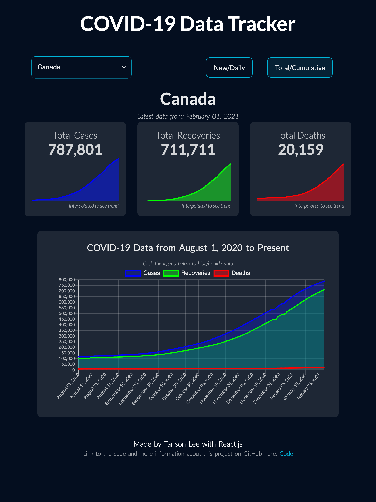

# COVID-19 Data Tracker

The link to the hosted project is here: https://covid19-tracker-tansonlee.netlify.app/

<!-- https://tansonlee.github.io/covid19-data-tracker/ -->

This web application provides an intuitive UI for Canadians to track COVID-19 data.
It displays data for cases, recoveries, and deaths both new and total.

## About

This was made using the React.js framework. Some libraries that were used are:
* Axios: For handling REST API get requests
* Chartjs 2: For creating the charts
* Material UI: For the dropdown menu

The API used to fetch the data is opencovid. 
More information can be found on their website here: [https://opencovid.ca/](https://opencovid.ca/)

